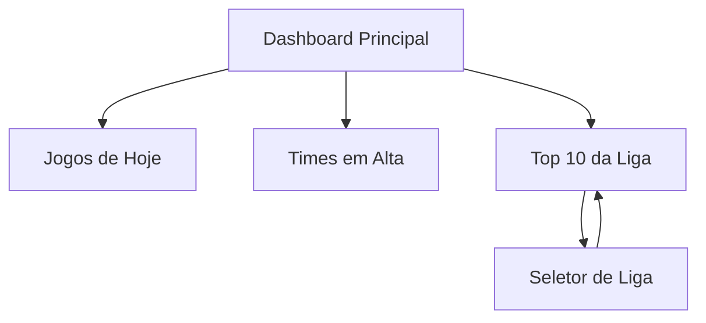

# HypeFC - Documento de Requisitos do Produto

## 1. Product Overview

HypeFC é uma plataforma web que exibe informações em tempo real sobre jogos de futebol e classificações dos principais campeonatos mundiais, destacando automaticamente os times em alta ("hype") baseado em performance e jogos do dia.

O produto resolve o problema de acompanhar múltiplas ligas simultaneamente, oferecendo uma visão consolidada dos jogos do dia e identificando oportunidades de investimento em times que estão em momento de destaque. Direcionado para entusiastas de futebol, apostadores e analistas esportivos que precisam de informações rápidas e organizadas.

O objetivo é se tornar a referência para identificação de times em alta no mercado de apostas esportivas brasileiro.

## 2. Core Features

### 2.1 User Roles
Não há distinção de papéis de usuário. O sistema é público e não requer autenticação.

### 2.2 Feature Module

Nossa aplicação HypeFC consiste nas seguintes páginas principais:

1. **Dashboard Principal**: seção de jogos do dia, card de times em alta, seletor de ligas para classificação.

### 2.3 Page Details

| Page Name | Module Name | Feature description |
|-----------|-------------|---------------------|
| Dashboard Principal | Jogos de Hoje | Exibir todos os jogos programados para o dia atual, organizados por liga. Mostrar horário, times mandante e visitante |
| Dashboard Principal | Times em Alta (Hype) | Listar automaticamente os times que estão em destaque baseado em critérios: jogam hoje, estão no top 3, são líderes da liga, ou participam de clássicos |
| Dashboard Principal | Top 10 da Liga | Mostrar classificação dos 10 primeiros colocados da liga selecionada. Incluir posição, nome do time, jogos, vitórias, empates, derrotas e pontos |
| Dashboard Principal | Seletor de Liga | Permitir escolha entre as ligas disponíveis (Brasileirão, Premier League, La Liga, Serie A, Ligue 1, Champions League) |

## 3. Core Process

**Fluxo Principal do Usuário:**
1. Usuário acessa a página principal do HypeFC
2. Visualiza automaticamente os jogos do dia organizados por liga
3. Consulta a lista de times em alta com suas respectivas razões de destaque
4. Seleciona uma liga específica para ver o top 10 da classificação
5. Pode alternar entre diferentes ligas para comparar classificações

**Fluxo de Atualização de Dados (Automático):**
1. Sistema executa cron job diário às 08:00 (-03:00)
2. Busca dados atualizados da API football-data.org
3. Atualiza classificações e jogos no banco de dados
4. Gera automaticamente as flags de hype baseado nas regras definidas
5. Dados ficam disponíveis para consulta na interface

## 4. User Interface Design

### 4.1 Design Style

- **Cores Primárias**: Verde escuro (#0f172a) para fundo, Verde claro (#10b981) para destaques
- **Cores Secundárias**: Cinza escuro (#1e293b) para cards, Branco (#ffffff) para textos principais
- **Estilo de Botões**: Arredondados com hover effects, estilo moderno do shadcn/ui
- **Fonte**: Inter ou system font, tamanhos 14px (corpo), 18px (subtítulos), 24px (títulos)
- **Layout**: Card-based com grid responsivo, navegação superior fixa
- **Ícones**: Lucide React icons, estilo minimalista e consistente

### 4.2 Page Design Overview

| Page Name | Module Name | UI Elements |
|-----------|-------------|-------------|
| Dashboard Principal | Header | Título "HypeFC — Times quentes para vender hoje" em fonte bold 24px, fundo escuro com gradiente sutil |
| Dashboard Principal | Jogos de Hoje | Cards brancos com sombra, layout em grid 2-3 colunas, ícones de futebol, horários em destaque verde |
| Dashboard Principal | Times em Alta | Lista vertical com badges coloridos por prioridade (vermelho para priority 1, amarelo para priority 2), animação de fade-in |
| Dashboard Principal | Top 10 da Liga | Tabela responsiva com zebra striping, header fixo, números de posição em círculos coloridos |
| Dashboard Principal | Seletor de Liga | Dropdown elegante com flags dos países, transições suaves entre seleções |

### 4.3 Responsiveness

O produto é mobile-first com adaptação para desktop. Em dispositivos móveis, os cards se reorganizam em coluna única, mantendo toda funcionalidade. Otimizado para touch interaction com botões e áreas clicáveis de tamanho adequado (mínimo 44px).