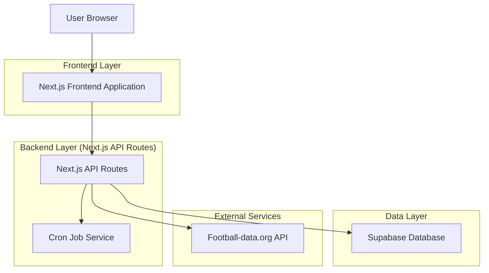
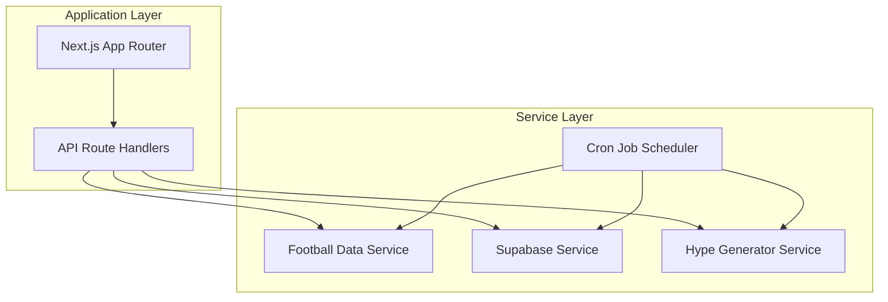
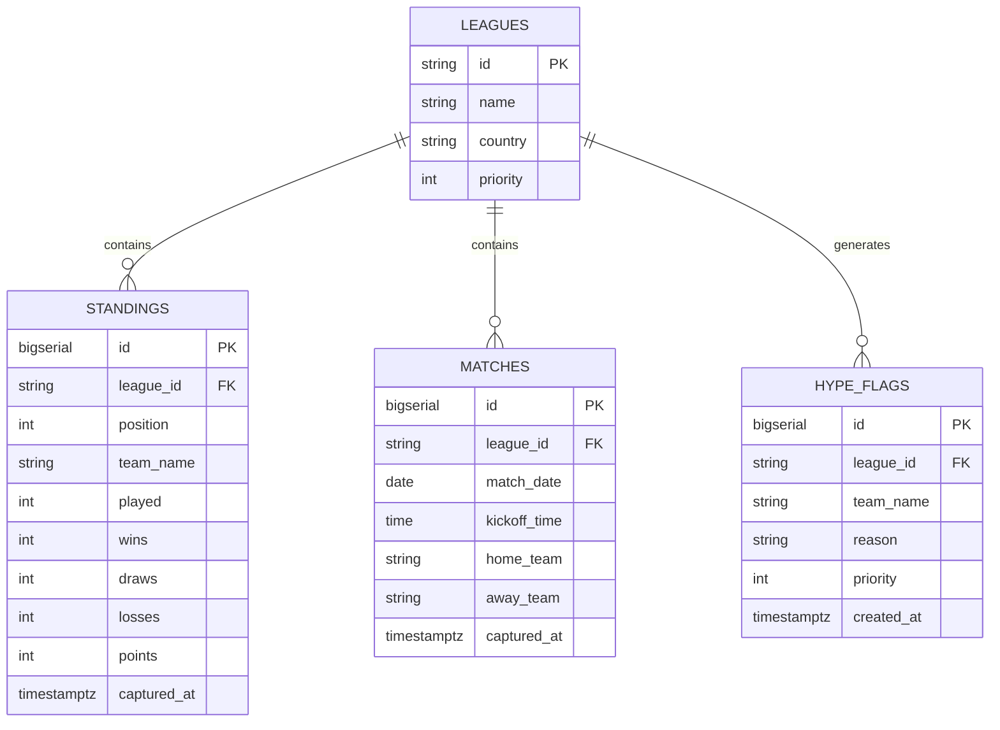

# HypeFC - Documento de Arquitetura Técnica

## 1. Architecture design



## 2. Technology Description

- Frontend: Next.js@14 + React@18 + TypeScript + Tailwind CSS@3 + shadcn/ui
- Backend: Next.js API Routes + node-cron
- Database: Supabase (PostgreSQL)
- External API: football-data.org API v4

## 3. Route definitions

| Route | Purpose |
|-------|---------|
| / | Dashboard principal, exibe jogos do dia, times em alta e top 10 das ligas |
| /api/dashboard/today | API endpoint que retorna jogos do dia e times em alta |
| /api/dashboard/standings/[league_id] | API endpoint que retorna top 10 da classificação da liga especificada |
| /api/cron/daily-sync | Endpoint interno para sincronização diária de dados |

## 4. API definitions

### 4.1 Core API

**Dados do Dashboard de Hoje**
```
GET /api/dashboard/today
```

Response:
| Param Name | Param Type | Description |
|------------|------------|-------------|
| matches | Match[] | Lista de jogos do dia organizados por liga |
| hypeFlags | HypeFlag[] | Lista de times em alta ordenados por prioridade |

Example Response:
```json
{
  "matches": [
    {
      "id": 1,
      "league_id": "PL",
      "match_date": "2024-01-15",
      "kickoff_time": "16:00:00",
      "home_team": "Manchester City",
      "away_team": "Liverpool"
    }
  ],
  "hypeFlags": [
    {
      "id": 1,
      "league_id": "PL",
      "team_name": "Manchester City",
      "reason": "Líder da liga",
      "priority": 1
    }
  ]
}
```

**Classificação da Liga**
```
GET /api/dashboard/standings/[league_id]
```

Request:
| Param Name | Param Type | isRequired | Description |
|------------|------------|------------|-------------|
| league_id | string | true | ID da liga (PL, PD, SA, FL1, BSA, CL) |

Response:
| Param Name | Param Type | Description |
|------------|------------|-------------|
| standings | Standing[] | Top 10 da classificação da liga |

Example Response:
```json
{
  "standings": [
    {
      "position": 1,
      "team_name": "Manchester City",
      "played": 20,
      "wins": 15,
      "draws": 3,
      "losses": 2,
      "points": 48
    }
  ]
}
```

## 5. Server architecture diagram



## 6. Data model

### 6.1 Data model definition



### 6.2 Data Definition Language

**Tabela de Ligas (leagues)**
```sql
-- create table
CREATE TABLE leagues (
    id TEXT PRIMARY KEY,
    name TEXT NOT NULL,
    country TEXT NOT NULL,
    priority INTEGER DEFAULT 1
);

-- init data
INSERT INTO leagues (id, name, country, priority) VALUES
('BSA', 'Brasileirão Série A', 'Brazil', 1),
('PL', 'Premier League', 'England', 2),
('PD', 'La Liga', 'Spain', 3),
('SA', 'Serie A', 'Italy', 4),
('FL1', 'Ligue 1', 'France', 5),
('CL', 'Champions League', 'Europe', 6);

-- permissions
GRANT SELECT ON leagues TO anon;
GRANT ALL PRIVILEGES ON leagues TO authenticated;
```

**Tabela de Classificações (standings)**
```sql
-- create table
CREATE TABLE standings (
    id BIGSERIAL PRIMARY KEY,
    league_id TEXT NOT NULL,
    position INTEGER NOT NULL,
    team_name TEXT NOT NULL,
    played INTEGER DEFAULT 0,
    wins INTEGER DEFAULT 0,
    draws INTEGER DEFAULT 0,
    losses INTEGER DEFAULT 0,
    points INTEGER DEFAULT 0,
    captured_at TIMESTAMPTZ DEFAULT NOW()
);

-- create indexes
CREATE INDEX idx_standings_league_id ON standings(league_id);
CREATE INDEX idx_standings_position ON standings(position);
CREATE INDEX idx_standings_captured_at ON standings(captured_at DESC);

-- permissions
GRANT SELECT ON standings TO anon;
GRANT ALL PRIVILEGES ON standings TO authenticated;
```

**Tabela de Jogos (matches)**
```sql
-- create table
CREATE TABLE matches (
    id BIGSERIAL PRIMARY KEY,
    league_id TEXT NOT NULL,
    match_date DATE NOT NULL,
    kickoff_time TIME,
    home_team TEXT NOT NULL,
    away_team TEXT NOT NULL,
    captured_at TIMESTAMPTZ DEFAULT NOW()
);

-- create indexes
CREATE INDEX idx_matches_league_id ON matches(league_id);
CREATE INDEX idx_matches_date ON matches(match_date);
CREATE INDEX idx_matches_captured_at ON matches(captured_at DESC);

-- permissions
GRANT SELECT ON matches TO anon;
GRANT ALL PRIVILEGES ON matches TO authenticated;
```

**Tabela de Times em Alta (hype_flags)**
```sql
-- create table
CREATE TABLE hype_flags (
    id BIGSERIAL PRIMARY KEY,
    league_id TEXT NOT NULL,
    team_name TEXT NOT NULL,
    reason TEXT NOT NULL,
    priority INTEGER NOT NULL,
    created_at TIMESTAMPTZ DEFAULT NOW()
);

-- create indexes
CREATE INDEX idx_hype_flags_league_id ON hype_flags(league_id);
CREATE INDEX idx_hype_flags_priority ON hype_flags(priority);
CREATE INDEX idx_hype_flags_created_at ON hype_flags(created_at DESC);

-- permissions
GRANT SELECT ON hype_flags TO anon;
GRANT ALL PRIVILEGES ON hype_flags TO authenticated;
```