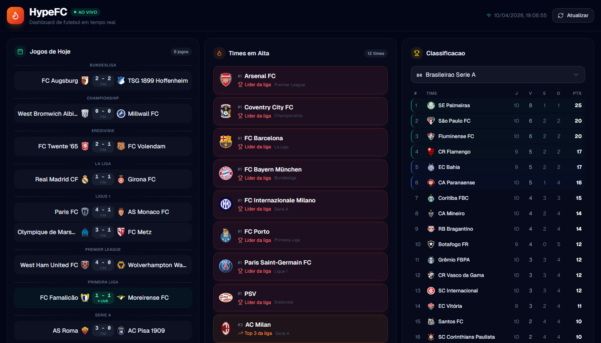

# HypeFC

> Dashboard de futebol em tempo real que identifica **times em alta** nas principais ligas do mundo.

<div align="center">


</div>

<div align="center">
  
</div>

---

## O que faz

O HypeFC consome a [Football-Data.org API](https://www.football-data.org/) em **tempo real** e aplica um algoritmo de hype para destacar:

- **Lider da liga** - time no topo da classificacao
- **Top 3** - times nas primeiras posicoes
- **Jogando hoje** - times com partida no dia, com placar ao vivo

Tudo sem banco de dados - dados vem direto da API com cache inteligente.

## Features

| Feature | Descricao |
|---------|-----------|
| **Jogos de Hoje** | Partidas agrupadas por liga com escudos, posicoes e placar ao vivo |
| **Times em Alta** | Deteccao automatica com badges de prioridade e nome da liga |
| **Classificacao** | Tabela com zonas visuais (Champions, Europa, Rebaixamento) |
| **10+ ligas** | Brasileirao, Premier League, La Liga, Serie A, Bundesliga, Ligue 1, Champions League |
| **Tempo real** | Placar ao vivo com indicador "LIVE" e status dos jogos |
| **Responsivo** | Mobile, tablet e desktop |

## Tech Stack

```
Frontend    Next.js 14 (App Router) + React + Tailwind CSS + shadcn/ui
API         Football-Data.org v4 (tempo real)
Cache       In-memory (5-10 min TTL)
Font        Geist Sans/Mono
Deploy      Vercel
```

## Setup

```bash
git clone https://github.com/JE4NVRG/HypeFc.git
cd HypeFc
npm install
cp .env.example .env.local
# Preencher FOOTBALL_API_TOKEN no .env.local
npm run dev
```

Para obter o token gratuito: [football-data.org/client/register](https://www.football-data.org/client/register)

### Deploy na Vercel

1. Conecte o repositorio no [vercel.com](https://vercel.com)
2. Adicione a env var `FOOTBALL_API_TOKEN` em Settings > Environment Variables
3. Deploy automatico a cada push

## Estrutura

```
src/
├── app/
│   ├── api/dashboard/        # API Routes (today + standings)
│   ├── layout.tsx            # Root layout (Geist)
│   ├── page.tsx              # Dashboard
│   └── globals.css
├── components/dashboard/     # Header, Matches, Hype, Standings, Footer
├── hooks/                    # useDashboardData
├── lib/                      # Cache in-memory
├── services/                 # Football-Data.org API client
└── types/                    # Types e mapeamentos de ligas
```

## Autor

**Jean Carlos Vargas da Silva** - [@JE4NVRG](https://github.com/JE4NVRG)

## Licenca

MIT
